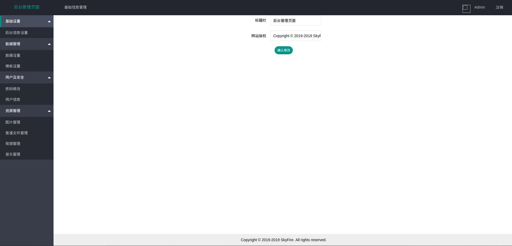

# 网站后台生成程序

本项目旨在快速搭建简易网站，后端使用python3，前端使用vue和layui。提供了命令行一键生成后台模板，用户只需要编写自己的业务逻辑就可以快速生成一个网站。

## 1. 使用

### （1）依赖安装

该项目的依赖在depends.txt文件中，可以使用以下命令安装：

```bash
pip install -r depends.txt --user
```

### （2）使用

build.py为生成工具，可以使用以下命令查看帮助：

```bash
python build.py -h
```

（部分系统可能需要使用`python3 build -h`）

输出如下：

```text
usage: build.py [-h] -p PROJECT_NAME -d DIRECTORY [-t TEMPLATE_DIR]
                [-s STATIC_DIR] [-v VIDEO_DIR] [-m MUSIC_DIR] [-i IMAGE_DIR]
                [-f FILE_DIR] [-P PORT] [-D JSON_DATA] [-a ARTICLE_FOLDER]
                [-T DATA_TEMPLATE] [-e EXTEND_DATA] [-H TITLE] [-F FOOTER]

optional arguments:
  -h, --help            show this help message and exit
  -p PROJECT_NAME, --project PROJECT_NAME
                        Project name
  -d DIRECTORY, --directory DIRECTORY
                        Output directory
  -t TEMPLATE_DIR, --template_dir TEMPLATE_DIR
                        Template file directory
  -s STATIC_DIR, --static_dir STATIC_DIR
                        Static files directory
  -v VIDEO_DIR, --video VIDEO_DIR
                        Video files directory
  -m MUSIC_DIR, --music MUSIC_DIR
                        Music files directory
  -i IMAGE_DIR, --image IMAGE_DIR
                        Image files directory
  -f FILE_DIR, --file FILE_DIR
                        General files directory
  -P PORT, --port PORT  Server port
  -D JSON_DATA, --jsondata JSON_DATA
                        Data file with json
  -a ARTICLE_FOLDER, --article_image ARTICLE_FOLDER
                        Article images directory
  -T DATA_TEMPLATE, --data_template DATA_TEMPLATE
                        Data tempalte file
  -e EXTEND_DATA, --extend_data EXTEND_DATA
                        Extend data file
  -H TITLE, --admin_header TITLE
                        Title of backstage management page
  -F FOOTER, --footer FOOTER
                        Title of backstage management page
```

创建模板项目时，-p和-d参数为必填项，分别表示项目名称和项目目录。

其他均为选填项目，如下：

- -t 模板目录，该目录下存放有injia的模板文件，在请求时被后台渲染。通常是html文件
- -s 静态目录，该目录存放静态文件，如js、css、html、图片资源等
- -v 视频目录，该目录存放网站需要使用的视频文件
- -m 音频文件，该目录存放网站需要使用的音频文件
- -i 图片文件，该目录存放网站需要使用的图片文件
- -f 普通文件，该目录存放网站需要使用的其他文件
- -p 服务器的端口号
- -D 服务器数据文件，格式为一个json，该文件会被网站自动加载到内存，用来渲染前端页面。
- -a 文章图片文件目录，这个目录通常是为了存储文章的图片，该目录下的图片会由于文章的删除而被删除。
- -T 数据模板文件，在数据管理的时候，使用模板文件中的元素作为管理单元。
- -e 扩展数据文件，这个文件为数据文件的扩展，与-D制定的数据文件不同的是，此文件会在每次使用时重新加载。
- -H 后台模板标题
- -F 后台模板页脚文字

如我们需要创建一个test的项目，可以使用命令：

```bash
python build.py -p test -d ..
```

程序输出：

```text
finished! Just run "cd ../test && python.exe app.py"
Admin user name:Admin
Password:123456
```

生成的test目录结构如下：

```text
.
├── admin
│   ├── static
│   └── template
│       ├── admin.html
│       ├── base_info_manage.html
│       ├── data.html
│       ├── image_manage.html
│       ├── login_page.html
│       ├── music_manage.html
│       ├── normal_file_manage.html
│       ├── password_manage.html
│       ├── template.html
│       ├── user_info_manage.html
│       └── video_manage.html
├── admin.py
├── app.py
├── config
│   ├── config.json
│   ├── data_ext.json
│   ├── data.json
│   ├── module.json
│   └── template.json
├── config_manager.py
├── db
├── file
│   ├── article_image
│   ├── file_data
│   ├── image_data
│   ├── music_data
│   ├── thumbnail_data
│   └── video_data
├── file_manager.py
├── md_utils.py
├── user.py
├── website.py
└── www
    ├── static
    └── template
```

（上面的内容将layui、md5、vue等第三方js库省略掉了）

admin目录下为后台管理页面的代码，

- admin.html  后台管理框架页面
- base_info_manage.html 网站基础数据设置界面
- data.html  网站数据管理界面
- image_manage.html  图片管理界面
- login_page.html  后台登录页
- music_manage.html  音乐管理界面
- normal_file_manage.html  普通文件管理界面
- password_manage.html  密码修改界面
- template.html  数据模板管理界面
- user_info_manage.html  用户信息管理界面
- video_manage.html  视频管理界面

config目录为网站的配置：

- config.json  网站整体配置，包括端口号、标题、页脚文字等
- data_ext.json  扩展数据，默认为空json
- data.json  数据，默认为空json
- module.json  后台模块配置，默认内容如下：

```json
{
    "基础信息管理": {
        "数据管理": {
            "数据设置": {
                "url": "data.html"
            },
            "模板设置": {
                "url": "template.html"
            }
        },
        "资源管理": {
            "普通文件管理": {
                "url": "normal_file_manage.html"
            },
            "图片管理": {
                "url": "image_manage.html"
            },
            "音乐管理": {
                "url": "music_manage.html"
            },
            "视频管理": {
                "url": "video_manage.html"
            }
        },
        "基础设置": {
            "后台信息设置": {
                "url": "base_info_manage.html"
            }
        },
        "用户及安全": {
            "用户信息": {
                "url": "user_info_manage.html"
            },
            "密码修改": {
                "url": "password_manage.html"
            }
        }
    }
}⏎    
```

格式为：

```json
{
    "顶部菜单项"：{
        "左侧菜单项"：{
            "左侧次级菜单项":{
                "url":"页面地址"
            }
        }
    }
}
```

- template.json  表示模板数据，默认为空json。

file目录下为图片、视频等文件。

www目录为网站前台页面文件分别有静态文件和模板文件。

db为数据库文件。

admin.py为后台模块文件。

app.py为整个项目启动文件。

config_manager.py 为配置管理模块文件。

file_manager.py 为文件管理模块文件。

md_utils.py 为工具模块文件。

user.py 为用户管理模块文件。

website.py 前端模块文件，后续编写代码主要在这个文件中。

在test目录下，运行：

```python
python app.py
```

打开浏览器，访问[http://127.0.0.1:8080/admin](http://127.0.0.1:8080/admin)就可以进入登录界面，使用Admin和123456登录后，就可以看到管理界面了：


